 

Java Backend Engineer

<h1 style="font-size: 2.8rem; font-weight: 700; color: #f0f6fc; margin: 0 0 8px; letter-spacing: -1px;">Jana Karthik Siva Teja</h1>

  I build production-grade backend systems — secure APIs, scalable databases, and deployable software — using Java, Spring Boot, and modern infrastructure.

 

  <a href="https://github.com/karthikJKST/karthik-portfolio" style="display: inline-block; background: #238636; color: #fff; padding: 10px 24px; border-radius: 6px; text-decoration: none; font-size: 0.9rem; font-weight: 500;">Portfolio</a>
  
  <a href="jana_karthik_siva_teja_Resume.pdf" style="display: inline-block; border: 1px solid #30363d; color: #f0f6fc; padding: 10px 24px; border-radius: 6px; text-decoration: none; font-size: 0.9rem;">Resume</a>
  
  <a href="https://linkedin.com/in/karthik-siva-teja-jana-a367a0275" style="display: inline-block; border: 1px solid #30363d; color: #f0f6fc; padding: 10px 24px; border-radius: 6px; text-decoration: none; font-size: 0.9rem;">LinkedIn</a>
  
  <a href="mailto:karthikshivatejaj@gmail.com" style="display: inline-block; border: 1px solid #30363d; color: #f0f6fc; padding: 10px 24px; border-radius: 6px; text-decoration: none; font-size: 0.9rem;">Email</a>

 

<table style="max-width: 700px; margin: 0 auto;">
  <tr>
    <td align="center" width="16%" style="background: rgba(22,27,34,0.8); border: 1px solid #30363d; border-radius: 8px; padding: 14px 6px;">
      6+ Projects
    </td>
    <td align="center" width="16%" style="background: rgba(22,27,34,0.8); border: 1px solid #30363d; border-radius: 8px; padding: 14px 6px;">
      3 Live Deployments
    </td>
    <td align="center" width="16%" style="background: rgba(22,27,34,0.8); border: 1px solid #30363d; border-radius: 8px; padding: 14px 6px;">
      30+ REST Endpoints
    </td>
    <td align="center" width="16%" style="background: rgba(51,51,51,0.4); border: 1px solid rgba(88,166,255,0.2); border-radius: 8px; padding: 14px 6px;">
      Spring Boot
    </td>
    <td align="center" width="16%" style="background: rgba(51,51,51,0.4); border: 1px solid rgba(88,166,255,0.2); border-radius: 8px; padding: 14px 6px;">
      PostgreSQL
    </td>
    <td align="center" width="16%" style="background: rgba(51,51,51,0.4); border: 1px solid rgba(88,166,255,0.2); border-radius: 8px; padding: 14px 6px;">
      Docker
    </td>
  </tr>
</table>

 

 
 

## About

  I'm a <strong style="color: #f0f6fc;">Java Backend Engineer</strong> pursuing B.Tech in Computer Science at VIT-AP (2022–2026). I design systems that are <strong style="color: #f0f6fc;">secure</strong>, <strong style="color: #f0f6fc;">testable</strong>, and <strong style="color: #f0f6fc;">deployed</strong> — not just pushed to a repository. Every project I build includes authentication, containerization, and an automated delivery pipeline.

 
 

<table>
  <tr>
    <td width="50%" valign="top" style="padding-right: 20px;">
      <table style="width: 100%;">
        <tr><td colspan="2" style="padding-bottom: 12px;"><h3 style="color: #f0f6fc; margin: 0; font-size: 1.1rem;">⚙️ What I Build</h3></td></tr>
        <tr>
          <td width="50%" valign="top" style="background: #161b22; border: 1px solid #30363d; border-radius: 8px; padding: 14px;">
            
⚡ <strong style="color: #58a6ff; font-size: 0.85rem;">REST APIs</strong>

            
Layered architecture · Validation · Error handling

          </td>
          <td width="50%" valign="top" style="background: #161b22; border: 1px solid #30363d; border-radius: 8px; padding: 14px;">
            
🔐 <strong style="color: #58a6ff; font-size: 0.85rem;">Auth Systems</strong>

            
JWT tokens · Spring Security · RBAC

          </td>
        </tr>
        <tr>
          <td width="50%" valign="top" style="background: #161b22; border: 1px solid #30363d; border-radius: 8px; padding: 14px;">
            
🗄️ <strong style="color: #58a6ff; font-size: 0.85rem;">Database Design</strong>

            
PostgreSQL · Flyway · JPA · Connection pooling

          </td>
          <td width="50%" valign="top" style="background: #161b22; border: 1px solid #30363d; border-radius: 8px; padding: 14px;">
            
🔄 <strong style="color: #58a6ff; font-size: 0.85rem;">Real-time Systems</strong>

            
WebSocket · STOMP · Live data delivery

          </td>
        </tr>
        <tr>
          <td width="50%" valign="top" style="background: #161b22; border: 1px solid #30363d; border-radius: 8px; padding: 14px;">
            
🐳 <strong style="color: #58a6ff; font-size: 0.85rem;">Containerization</strong>

            
Docker multi-stage · Compose · Health checks

          </td>
          <td width="50%" valign="top" style="background: #161b22; border: 1px solid #30363d; border-radius: 8px; padding: 14px;">
            
🔄 <strong style="color: #58a6ff; font-size: 0.85rem;">CI/CD</strong>

            
GitHub Actions · Automated builds · Deploy

          </td>
        </tr>
      </table>
    </td>
    <td width="50%" valign="top" style="padding-left: 20px;">
      <table style="width: 100%;">
        <tr><td colspan="2" style="padding-bottom: 12px;"><h3 style="color: #f0f6fc; margin: 0; font-size: 1.1rem;">🎯 Why Work With Me</h3></td></tr>
        <tr>
          <td width="50%" valign="top" style="background: #161b22; border: 1px solid #30363d; border-radius: 8px; padding: 14px;">
            
🏭 <strong style="color: #f0f6fc; font-size: 0.85rem;">Production Mindset</strong>

            
Auth · Security · Error handling · Monitoring from day one

          </td>
          <td width="50%" valign="top" style="background: #161b22; border: 1px solid #30363d; border-radius: 8px; padding: 14px;">
            
📐 <strong style="color: #f0f6fc; font-size: 0.85rem;">Clean Architecture</strong>

            
Separation of concerns · Testable · Maintainable

          </td>
        </tr>
        <tr>
          <td width="50%" valign="top" style="background: #161b22; border: 1px solid #30363d; border-radius: 8px; padding: 14px;">
            
🔗 <strong style="color: #f0f6fc; font-size: 0.85rem;">Full Ownership</strong>

            
Backend → Frontend → DB → Docker → CI/CD

          </td>
          <td width="50%" valign="top" style="background: #161b22; border: 1px solid #30363d; border-radius: 8px; padding: 14px;">
            
📈 <strong style="color: #f0f6fc; font-size: 0.85rem;">Always Growing</strong>

            
Exploring CQRS · Kubernetes · Distributed systems

          </td>
        </tr>
      </table>
    </td>
  </tr>
</table>

 

---

 

## Featured Project

 

<table>
  <tr>
    <td width="55%" valign="top">
      

        

          
          
          
          weekdays.app/dashboard
        

        
      

    </td>
    <td width="45%" valign="top" style="padding-left: 24px;">
      <h2 style="margin: 0 0 2px; font-size: 1.6rem;">WeekDays</h2>
      
● Live in Production

      
Project management platform with Kanban boards, real-time task tracking, and team collaboration.

      

        <code style="background: rgba(240,246,252,0.08); color: #f0f6fc; padding: 3px 10px; border-radius: 6px; font-size: 0.75rem;">Spring Boot 3</code>
        <code style="background: rgba(240,246,252,0.08); color: #f0f6fc; padding: 3px 10px; border-radius: 6px; font-size: 0.75rem;">React 19</code>
        <code style="background: rgba(240,246,252,0.08); color: #f0f6fc; padding: 3px 10px; border-radius: 6px; font-size: 0.75rem;">PostgreSQL</code>
        <code style="background: rgba(240,246,252,0.08); color: #f0f6fc; padding: 3px 10px; border-radius: 6px; font-size: 0.75rem;">Docker</code>
        <code style="background: rgba(240,246,252,0.08); color: #f0f6fc; padding: 3px 10px; border-radius: 6px; font-size: 0.75rem;">JWT</code>
        <code style="background: rgba(240,246,252,0.08); color: #f0f6fc; padding: 3px 10px; border-radius: 6px; font-size: 0.75rem;">Flyway</code>
      

      <table style="width: 100%;">
        <tr>
          <td width="50%" style="padding: 4px 4px 4px 0;">
            
▸ JWT access/refresh token rotation

          </td>
          <td width="50%" style="padding: 4px 0 4px 4px;">
            
▸ Flyway versioned migrations

          </td>
        </tr>
        <tr>
          <td width="50%" style="padding: 4px 4px 4px 0;">
            
▸ Role-based access control

          </td>
          <td width="50%" style="padding: 4px 0 4px 4px;">
            
▸ Docker Compose orchestration

          </td>
        </tr>
        <tr>
          <td width="50%" style="padding: 4px 4px 4px 0;">
            
▸ Layered controller → service → repo

          </td>
          <td width="50%" style="padding: 4px 0 4px 4px;">
            
▸ CI/CD via GitHub Actions

          </td>
        </tr>
      </table>
      

        <a href="https://weekdays-gules.vercel.app" style="display: inline-block; background: #238636; color: #fff; padding: 10px 24px; border-radius: 6px; text-decoration: none; font-size: 0.85rem; font-weight: 500;">Live Demo</a>
        
        <a href="https://github.com/karthikJKST/WeekDays" style="display: inline-block; border: 1px solid #30363d; color: #f0f6fc; padding: 10px 24px; border-radius: 6px; text-decoration: none; font-size: 0.85rem;">Repository</a>
      

    </td>
  </tr>
</table>

 

---

 

## More Projects

 

<table>
  <tr>
    <td width="33%" valign="top" style="padding-right: 10px;">
      

        

          
          
          
        

        
        

          <h3 style="margin: 0 0 2px; font-size: 1.05rem;">StockFlow</h3>
          
● Live

          
Real-time stock analysis with WebSocket streaming and portfolio tracking.

          

            <code style="background: rgba(240,246,252,0.08); color: #f0f6fc; padding: 2px 8px; border-radius: 6px; font-size: 0.7rem;">Spring Boot</code>
            <code style="background: rgba(240,246,252,0.08); color: #f0f6fc; padding: 2px 8px; border-radius: 6px; font-size: 0.7rem;">WebSocket</code>
            <code style="background: rgba(240,246,252,0.08); color: #f0f6fc; padding: 2px 8px; border-radius: 6px; font-size: 0.7rem;">React</code>
            <code style="background: rgba(240,246,252,0.08); color: #f0f6fc; padding: 2px 8px; border-radius: 6px; font-size: 0.7rem;">PostgreSQL</code>
          

          

            <a href="https://stock-flow-ashen.vercel.app" style="color: #58a6ff; font-size: 0.85rem; text-decoration: none;">Live Demo →</a>
            ·
            <a href="https://github.com/karthikJKST/StockFlow" style="color: #8b949e; font-size: 0.85rem; text-decoration: none;">Repo</a>
          

        

      

    </td>
    <td width="33%" valign="top" style="padding: 0 10px;">
      

        

          
          
          
        

        
        

          <h3 style="margin: 0 0 2px; font-size: 1.05rem;">HirePilot</h3>
          
● Live

          
AI interview prep with Gemini-generated questions and real-time scoring.

          

            <code style="background: rgba(240,246,252,0.08); color: #f0f6fc; padding: 2px 8px; border-radius: 6px; font-size: 0.7rem;">FastAPI</code>
            <code style="background: rgba(240,246,252,0.08); color: #f0f6fc; padding: 2px 8px; border-radius: 6px; font-size: 0.7rem;">Gemini API</code>
            <code style="background: rgba(240,246,252,0.08); color: #f0f6fc; padding: 2px 8px; border-radius: 6px; font-size: 0.7rem;">React</code>
            <code style="background: rgba(240,246,252,0.08); color: #f0f6fc; padding: 2px 8px; border-radius: 6px; font-size: 0.7rem;">JWT</code>
          

          

            <a href="https://ai-career-assistant-b9cs.onrender.com" style="color: #58a6ff; font-size: 0.85rem; text-decoration: none;">Live Demo →</a>
            ·
            <a href="https://github.com/karthikJKST/AI-Career-Assistant" style="color: #8b949e; font-size: 0.85rem; text-decoration: none;">Repo</a>
          

        

      

    </td>
    <td width="33%" valign="top" style="padding-left: 10px;">
      

        

          
          
          
        

        

          
Terminal Preview

        

        

          <h3 style="margin: 0 0 2px; font-size: 1.05rem;">Phoenix</h3>
          
● Beta

          
AI desktop assistant with voice control and cross-app automation.

          

            <code style="background: rgba(240,246,252,0.08); color: #f0f6fc; padding: 2px 8px; border-radius: 6px; font-size: 0.7rem;">Python</code>
            <code style="background: rgba(240,246,252,0.08); color: #f0f6fc; padding: 2px 8px; border-radius: 6px; font-size: 0.7rem;">LLM</code>
            <code style="background: rgba(240,246,252,0.08); color: #f0f6fc; padding: 2px 8px; border-radius: 6px; font-size: 0.7rem;">Desktop</code>
          

          

            <a href="https://github.com/karthikJKST/PHOENIX" style="color: #8b949e; font-size: 0.85rem; text-decoration: none;">Repository →</a>
          

        

      

    </td>
  </tr>
</table>

 
 

## Technology Stack

 

<table>
  <tr><td colspan="8" style="padding: 4px 0;">LANGUAGES</td></tr>
  <tr>
    <td align="center" width="12.5%" style="background: #161b22; border: 1px solid #30363d; border-radius: 8px; padding: 14px 4px;">☕ Java</td>
    <td align="center" width="12.5%" style="background: #161b22; border: 1px solid #30363d; border-radius: 8px; padding: 14px 4px;">🐍 Python</td>
    <td align="center" width="12.5%" style="background: #161b22; border: 1px solid #30363d; border-radius: 8px; padding: 14px 4px;">📘 TypeScript</td>
    <td align="center" width="12.5%" style="background: #161b22; border: 1px solid #30363d; border-radius: 8px; padding: 14px 4px;">🌐 JavaScript</td>
    <td align="center" width="12.5%" style="background: #161b22; border: 1px solid #30363d; border-radius: 8px; padding: 14px 4px;">🔷 SQL</td>
    <td align="center" width="12.5%" style="background: #161b22; border: 1px solid #30363d; border-radius: 8px; padding: 14px 4px;">💧 HTML/CSS</td>
    <td align="center" width="12.5%" style="background: #161b22; border: 1px solid #30363d; border-radius: 8px; padding: 14px 4px;">&nbsp;</td>
    <td align="center" width="12.5%" style="background: #161b22; border: 1px solid #30363d; border-radius: 8px; padding: 14px 4px;">&nbsp;</td>
  </tr>
</table>

 

<table>
  <tr><td colspan="8" style="padding: 4px 0;">BACKEND</td></tr>
  <tr>
    <td align="center" width="12.5%" style="background: #161b22; border: 1px solid #30363d; border-radius: 8px; padding: 14px 4px;">🍃 Spring Boot</td>
    <td align="center" width="12.5%" style="background: #161b22; border: 1px solid #30363d; border-radius: 8px; padding: 14px 4px;">🔒 Spring Security</td>
    <td align="center" width="12.5%" style="background: #161b22; border: 1px solid #30363d; border-radius: 8px; padding: 14px 4px;">⚡ FastAPI</td>
    <td align="center" width="12.5%" style="background: #161b22; border: 1px solid #30363d; border-radius: 8px; padding: 14px 4px;">🔐 JWT</td>
    <td align="center" width="12.5%" style="background: #161b22; border: 1px solid #30363d; border-radius: 8px; padding: 14px 4px;">📡 WebSocket</td>
    <td align="center" width="12.5%" style="background: #161b22; border: 1px solid #30363d; border-radius: 8px; padding: 14px 4px;">🗄️ JPA/Hibernate</td>
    <td align="center" width="12.5%" style="background: #161b22; border: 1px solid #30363d; border-radius: 8px; padding: 14px 4px;">&nbsp;</td>
    <td align="center" width="12.5%" style="background: #161b22; border: 1px solid #30363d; border-radius: 8px; padding: 14px 4px;">&nbsp;</td>
  </tr>
</table>

 

<table>
  <tr><td colspan="8" style="padding: 4px 0;">FRONTEND</td></tr>
  <tr>
    <td align="center" width="12.5%" style="background: #161b22; border: 1px solid #30363d; border-radius: 8px; padding: 14px 4px;">⚛️ React</td>
    <td align="center" width="12.5%" style="background: #161b22; border: 1px solid #30363d; border-radius: 8px; padding: 14px 4px;">⚡ Vite</td>
    <td align="center" width="12.5%" style="background: #161b22; border: 1px solid #30363d; border-radius: 8px; padding: 14px 4px;">🎨 CSS3</td>
    <td align="center" width="12.5%" style="background: #161b22; border: 1px solid #30363d; border-radius: 8px; padding: 14px 4px;">&nbsp;</td>
    <td align="center" width="12.5%" style="background: #161b22; border: 1px solid #30363d; border-radius: 8px; padding: 14px 4px;">&nbsp;</td>
    <td align="center" width="12.5%" style="background: #161b22; border: 1px solid #30363d; border-radius: 8px; padding: 14px 4px;">&nbsp;</td>
    <td align="center" width="12.5%" style="background: #161b22; border: 1px solid #30363d; border-radius: 8px; padding: 14px 4px;">&nbsp;</td>
    <td align="center" width="12.5%" style="background: #161b22; border: 1px solid #30363d; border-radius: 8px; padding: 14px 4px;">&nbsp;</td>
  </tr>
</table>

 

<table>
  <tr><td colspan="8" style="padding: 4px 0;">DATABASE + CLOUD + DEVOPS</td></tr>
  <tr>
    <td align="center" width="12.5%" style="background: #161b22; border: 1px solid #30363d; border-radius: 8px; padding: 14px 4px;">🐘 PostgreSQL</td>
    <td align="center" width="12.5%" style="background: #161b22; border: 1px solid #30363d; border-radius: 8px; padding: 14px 4px;">🐳 Docker</td>
    <td align="center" width="12.5%" style="background: #161b22; border: 1px solid #30363d; border-radius: 8px; padding: 14px 4px;">🔄 GitHub Actions</td>
    <td align="center" width="12.5%" style="background: #161b22; border: 1px solid #30363d; border-radius: 8px; padding: 14px 4px;">📦 Docker Compose</td>
    <td align="center" width="12.5%" style="background: #161b22; border: 1px solid #30363d; border-radius: 8px; padding: 14px 4px;">☁️ Render</td>
    <td align="center" width="12.5%" style="background: #161b22; border: 1px solid #30363d; border-radius: 8px; padding: 14px 4px;">▲ Vercel</td>
    <td align="center" width="12.5%" style="background: #161b22; border: 1px solid #30363d; border-radius: 8px; padding: 14px 4px;">🕊️ Flyway</td>
    <td align="center" width="12.5%" style="background: #161b22; border: 1px solid #30363d; border-radius: 8px; padding: 14px 4px;">🤖 Gemini API</td>
  </tr>
</table>

 
 

## Current Focus

 

<table>
  <tr>
    <td width="50%" valign="top" style="background: #161b22; border: 1px solid #30363d; border-radius: 10px; padding: 20px;">
      
<strong style="color: #f0f6fc;">🔨 Building</strong>

      
Event-driven Spring Boot with CQRS pattern, message queues, and Redis caching.

    </td>
    <td width="50%" valign="top" style="background: #161b22; border: 1px solid #30363d; border-radius: 10px; padding: 20px;">
      
<strong style="color: #f0f6fc;">📖 Learning</strong>

      
Kubernetes, distributed systems, observability, and integration testing patterns.

    </td>
  </tr>
</table>

 
 

  

  

 
 

<h2 style="color: #f0f6fc; margin: 0 0 8px;">Let's Build Together</h2>

  Open to software engineering roles — Java backend, full-stack, and distributed systems.

  <a href="https://github.com/karthikJKST/karthik-portfolio" style="display: inline-block; background: #238636; color: #fff; padding: 10px 24px; border-radius: 6px; text-decoration: none; font-size: 0.9rem; font-weight: 500;">Portfolio</a>
  
  <a href="jana_karthik_siva_teja_Resume.pdf" style="display: inline-block; border: 1px solid #30363d; color: #f0f6fc; padding: 10px 24px; border-radius: 6px; text-decoration: none; font-size: 0.9rem;">Resume</a>
  
  <a href="https://linkedin.com/in/karthik-siva-teja-jana-a367a0275" style="display: inline-block; border: 1px solid #30363d; color: #f0f6fc; padding: 10px 24px; border-radius: 6px; text-decoration: none; font-size: 0.9rem;">LinkedIn</a>
  
  <a href="mailto:karthikshivatejaj@gmail.com" style="display: inline-block; border: 1px solid #30363d; color: #f0f6fc; padding: 10px 24px; border-radius: 6px; text-decoration: none; font-size: 0.9rem;">Email</a>

 

  © 2026 Jana Karthik Siva Teja

 
