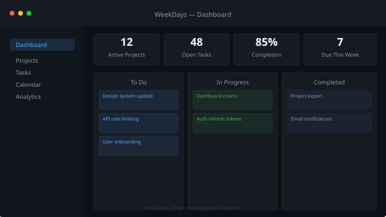
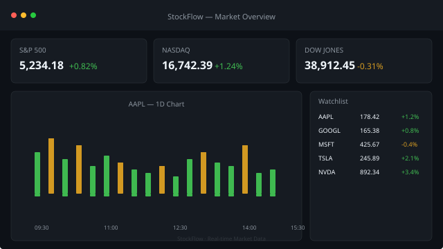
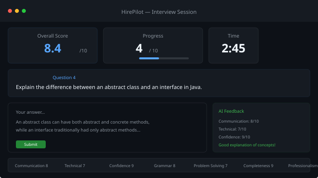

   
  <!-- assets/profile.jpg -->
   
  <h1>Jana Karthik Siva Teja</h1>
  

    I build production systems with Spring Boot, React, and PostgreSQL.
  

   
  

    <code style="background: rgba(88,166,255,0.1); color: #58a6ff; padding: 4px 12px; border-radius: 20px;">6+ Projects</code>
    <code style="background: rgba(63,185,80,0.1); color: #3fb950; padding: 4px 12px; border-radius: 20px;">3 Live</code>
    <code style="background: rgba(240,246,252,0.06); color: #f0f6fc; padding: 4px 12px; border-radius: 20px;">Spring Boot</code>
    <code style="background: rgba(240,246,252,0.06); color: #f0f6fc; padding: 4px 12px; border-radius: 20px;">PostgreSQL</code>
    <code style="background: rgba(240,246,252,0.06); color: #f0f6fc; padding: 4px 12px; border-radius: 20px;">Docker</code>
  

   
  

    <a href="https://github.com/karthikJKST/karthik-portfolio">Portfolio</a>
    &nbsp;·&nbsp;
    <a href="jana_karthik_siva_teja_Resume.pdf">Resume</a>
    &nbsp;·&nbsp;
    <a href="https://linkedin.com/in/karthik-siva-teja-jana-a367a0275">LinkedIn</a>
    &nbsp;·&nbsp;
    <a href="mailto:karthikshivatejaj@gmail.com">Email</a>
  

   

 

---

 

## Featured Work

 

<!-- WeekDays - Large banner layout (image left, content right) -->
<table>
  <tr>
    <td width="55%" valign="top">
      
    </td>
    <td width="45%" valign="top">
      <h2 style="margin-top: 0;">WeekDays</h2>
      
● Production

      
Project management platform with Kanban boards, real-time analytics, and calendar views. Built for teams.

      

        <code style="background: rgba(240,246,252,0.06); color: #f0f6fc; padding: 2px 8px; border-radius: 4px; font-size: 0.8rem;">Spring Boot</code>
        <code style="background: rgba(240,246,252,0.06); color: #f0f6fc; padding: 2px 8px; border-radius: 4px; font-size: 0.8rem;">React</code>
        <code style="background: rgba(240,246,252,0.06); color: #f0f6fc; padding: 2px 8px; border-radius: 4px; font-size: 0.8rem;">PostgreSQL</code>
        <code style="background: rgba(240,246,252,0.06); color: #f0f6fc; padding: 2px 8px; border-radius: 4px; font-size: 0.8rem;">Docker</code>
      

       
      <a href="https://weekdays-gules.vercel.app" style="background: #238636; color: white; padding: 8px 20px; border-radius: 6px; text-decoration: none; font-size: 0.9rem;">Live Demo</a>
      &nbsp;
      <a href="https://github.com/karthikJKST/WeekDays" style="border: 1px solid #30363d; color: #f0f6fc; padding: 8px 20px; border-radius: 6px; text-decoration: none; font-size: 0.9rem;">Repository</a>
    </td>
  </tr>
</table>

 
 

<!-- StockFlow - Reversed layout (content left, image right) -->
<table>
  <tr>
    <td width="45%" valign="top">
      <h2 style="margin-top: 0;">StockFlow</h2>
      
● Live

      
Real-time stock analysis. Live quotes, technical indicators, and portfolio tracking with WebSocket streaming.

      

        <code style="background: rgba(240,246,252,0.06); color: #f0f6fc; padding: 2px 8px; border-radius: 4px; font-size: 0.8rem;">Spring Boot</code>
        <code style="background: rgba(240,246,252,0.06); color: #f0f6fc; padding: 2px 8px; border-radius: 4px; font-size: 0.8rem;">WebSocket</code>
        <code style="background: rgba(240,246,252,0.06); color: #f0f6fc; padding: 2px 8px; border-radius: 4px; font-size: 0.8rem;">React</code>
        <code style="background: rgba(240,246,252,0.06); color: #f0f6fc; padding: 2px 8px; border-radius: 4px; font-size: 0.8rem;">PostgreSQL</code>
      

       
      <a href="https://stock-flow-ashen.vercel.app" style="background: #238636; color: white; padding: 8px 20px; border-radius: 6px; text-decoration: none; font-size: 0.9rem;">Live Demo</a>
      &nbsp;
      <a href="https://github.com/karthikJKST/StockFlow" style="border: 1px solid #30363d; color: #f0f6fc; padding: 8px 20px; border-radius: 6px; text-decoration: none; font-size: 0.9rem;">Repository</a>
    </td>
    <td width="55%" valign="top">
      
    </td>
  </tr>
</table>

 
 

<!-- HirePilot + Phoenix - Two column bento grid (compact) -->
<table>
  <tr>
    <td width="50%" valign="top">
      

        
        <h3 style="margin: 0 0 4px;">HirePilot</h3>
        
AI interview prep with Gemini question generation and resume matching.

        

          <code style="background: rgba(240,246,252,0.06); color: #f0f6fc; padding: 2px 8px; border-radius: 4px; font-size: 0.75rem;">FastAPI</code>
          <code style="background: rgba(240,246,252,0.06); color: #f0f6fc; padding: 2px 8px; border-radius: 4px; font-size: 0.75rem;">Gemini API</code>
          <code style="background: rgba(240,246,252,0.06); color: #f0f6fc; padding: 2px 8px; border-radius: 4px; font-size: 0.75rem;">React</code>
        

        

          <a href="https://ai-career-assistant-b9cs.onrender.com" style="color: #58a6ff; font-size: 0.85rem;">Live →</a>
          &nbsp;
          <a href="https://github.com/karthikJKST/AI-Career-Assistant" style="color: #8b949e; font-size: 0.85rem;">Repo</a>
        

      

    </td>
    <td width="50%" valign="top">
      

        <!-- Screenshot: assets/phoenix-terminal.png -->
        

          Terminal Preview
        

        <h3 style="margin: 0 0 4px;">Phoenix</h3>
        
AI desktop assistant with LLM planning, voice control, and cross-app automation.

        

          <code style="background: rgba(240,246,252,0.06); color: #f0f6fc; padding: 2px 8px; border-radius: 4px; font-size: 0.75rem;">Python</code>
          <code style="background: rgba(240,246,252,0.06); color: #f0f6fc; padding: 2px 8px; border-radius: 4px; font-size: 0.75rem;">LLM</code>
          <code style="background: rgba(240,246,252,0.06); color: #f0f6fc; padding: 2px 8px; border-radius: 4px; font-size: 0.75rem;">Desktop</code>
        

        

          <a href="https://github.com/karthikJKST/PHOENIX" style="color: #8b949e; font-size: 0.85rem;">Repo</a>
        

      

    </td>
  </tr>
</table>

 

---

 

## Engineering

<table>
  <tr>
    <td valign="top" width="25%" style="padding: 8px;">
      <strong style="color: #f0f6fc;">REST APIs</strong>
      
30+ endpoints · Layered architecture · Input validation

    </td>
    <td valign="top" width="25%" style="padding: 8px;">
      <strong style="color: #f0f6fc;">JWT Auth</strong>
      
Access + refresh tokens · Spring Security · BCrypt

    </td>
    <td valign="top" width="25%" style="padding: 8px;">
      <strong style="color: #f0f6fc;">Docker</strong>
      
Multi-stage builds · Compose orchestration · Health checks

    </td>
    <td valign="top" width="25%" style="padding: 8px;">
      <strong style="color: #f0f6fc;">CI/CD</strong>
      
GitHub Actions · Build + test · Automated deploy

    </td>
  </tr>
  <tr>
    <td valign="top" width="25%" style="padding: 8px;">
      <strong style="color: #f0f6fc;">PostgreSQL</strong>
      
Flyway migrations · JPA/Hibernate · Connection pooling

    </td>
    <td valign="top" width="25%" style="padding: 8px;">
      <strong style="color: #f0f6fc;">WebSocket</strong>
      
STOMP streaming · Real-time data · Live updates

    </td>
    <td valign="top" width="25%" style="padding: 8px;">
      <strong style="color: #f0f6fc;">Cloud</strong>
      
Vercel · Render · Neon PostgreSQL

    </td>
    <td valign="top" width="25%" style="padding: 8px;">
      <strong style="color: #f0f6fc;">Spring Boot</strong>
      
Security · JPA · Actuator · Validation

    </td>
  </tr>
</table>

 

---

 

### GitHub

 

 

---

 

**Building:** Event-driven Spring Boot with CQRS.  
**Learning:** Kubernetes, distributed systems, observability.

 

  <a href="https://github.com/karthikJKST/karthik-portfolio">Portfolio</a>
  &nbsp;·&nbsp;
  <a href="jana_karthik_siva_teja_Resume.pdf">Resume</a>
  &nbsp;·&nbsp;
  <a href="https://linkedin.com/in/karthik-siva-teja-jana-a367a0275">LinkedIn</a>
  &nbsp;·&nbsp;
  <a href="mailto:karthikshivatejaj@gmail.com">Email</a>

 

