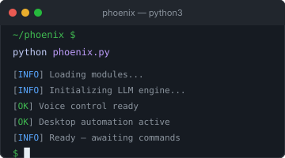

  
  Open to Software Engineering Opportunities

Java Backend Engineer

  I build production-grade backend systems using Spring Boot, PostgreSQL, Docker, and React.

  <a href="https://github.com/karthikJKST/karthik-portfolio" style="display: inline-block; background: #238636; color: #fff; padding: 10px 24px; border-radius: 8px; text-decoration: none; font-size: 0.85rem; font-weight: 500; box-shadow: 0 1px 3px rgba(0,0,0,0.3);">Portfolio</a>
  
  <a href="jana_karthik_siva_teja_Resume.pdf" style="display: inline-block; border: 1px solid #30363d; color: #c9d1d9; padding: 10px 24px; border-radius: 8px; text-decoration: none; font-size: 0.85rem; box-shadow: 0 1px 2px rgba(0,0,0,0.2);">Resume</a>
  
  <a href="https://github.com/karthikJKST" style="display: inline-block; border: 1px solid #30363d; color: #c9d1d9; padding: 10px 24px; border-radius: 8px; text-decoration: none; font-size: 0.85rem; box-shadow: 0 1px 2px rgba(0,0,0,0.2);">GitHub</a>
  
  <a href="https://linkedin.com/in/karthik-siva-teja-jana-a367a0275" style="display: inline-block; border: 1px solid #30363d; color: #c9d1d9; padding: 10px 24px; border-radius: 8px; text-decoration: none; font-size: 0.85rem; box-shadow: 0 1px 2px rgba(0,0,0,0.2);">LinkedIn</a>
  
  <a href="mailto:karthikshivatejaj@gmail.com" style="display: inline-block; border: 1px solid #30363d; color: #c9d1d9; padding: 10px 24px; border-radius: 8px; text-decoration: none; font-size: 0.85rem; box-shadow: 0 1px 2px rgba(0,0,0,0.2);">Email</a>

  <code style="background: rgba(240,246,252,0.05); color: #e6edf3; padding: 4px 14px; border-radius: 20px; font-size: 0.78rem;">6+ Projects</code>
  ·
  <code style="background: rgba(240,246,252,0.05); color: #e6edf3; padding: 4px 14px; border-radius: 20px; font-size: 0.78rem;">3 Live Apps</code>
  ·
  <code style="background: rgba(240,246,252,0.05); color: #e6edf3; padding: 4px 14px; border-radius: 20px; font-size: 0.78rem;">30+ REST APIs</code>
   
  <code style="background: rgba(88,166,255,0.06); color: #58a6ff; padding: 4px 14px; border-radius: 20px; font-size: 0.78rem;">Spring Boot</code>
  ·
  <code style="background: rgba(88,166,255,0.06); color: #58a6ff; padding: 4px 14px; border-radius: 20px; font-size: 0.78rem;">Docker</code>
  ·
  <code style="background: rgba(88,166,255,0.06); color: #58a6ff; padding: 4px 14px; border-radius: 20px; font-size: 0.78rem;">PostgreSQL</code>

 
 

<h2 style="font-size: 1.3rem; color: #f0f6fc; font-weight: 600; margin: 0 0 24px; letter-spacing: -0.5px;">Featured Projects</h2>

<table>
  <tr>
    <td width="55%" valign="top" style="padding: 0 20px 0 0;">
      

        
      

    </td>
    <td width="45%" valign="top">
      <h3 style="margin: 0 0 2px; font-size: 1.2rem; font-weight: 600;">WeekDays</h3>
      
● Live in Production

      
Project management platform with Kanban boards, real-time task tracking, and team collaboration.

      

        <code style="background: rgba(240,246,252,0.06); color: #e6edf3; padding: 2px 10px; border-radius: 4px; font-size: 0.72rem;">Spring Boot 3</code>
        <code style="background: rgba(240,246,252,0.06); color: #e6edf3; padding: 2px 10px; border-radius: 4px; font-size: 0.72rem;">React 19</code>
        <code style="background: rgba(240,246,252,0.06); color: #e6edf3; padding: 2px 10px; border-radius: 4px; font-size: 0.72rem;">PostgreSQL</code>
        <code style="background: rgba(240,246,252,0.06); color: #e6edf3; padding: 2px 10px; border-radius: 4px; font-size: 0.72rem;">Docker</code>
        <code style="background: rgba(240,246,252,0.06); color: #e6edf3; padding: 2px 10px; border-radius: 4px; font-size: 0.72rem;">JWT</code>
      

      
JWT auth · Flyway migrations · RBAC · Docker Compose · CI/CD

      

        <a href="https://weekdays-gules.vercel.app" style="display: inline-block; background: #238636; color: #fff; padding: 8px 22px; border-radius: 6px; text-decoration: none; font-size: 0.85rem; font-weight: 500;">Live Demo</a>
        
        <a href="https://github.com/karthikJKST/WeekDays" style="display: inline-block; border: 1px solid #30363d; color: #c9d1d9; padding: 8px 22px; border-radius: 6px; text-decoration: none; font-size: 0.85rem;">Repository</a>
      

    </td>
  </tr>
</table>

 

<table>
  <tr>
    <td width="33%" valign="top" style="padding: 0 10px 0 0;">
      

        
      

      <h3 style="margin: 10px 0 2px; font-size: 1rem; font-weight: 600;">StockFlow</h3>
      
● Live

      
Real-time stock analysis with WebSocket streaming and portfolio tracking.

      

        <code style="background: rgba(240,246,252,0.06); color: #e6edf3; padding: 2px 8px; border-radius: 4px; font-size: 0.68rem;">Spring Boot</code>
        <code style="background: rgba(240,246,252,0.06); color: #e6edf3; padding: 2px 8px; border-radius: 4px; font-size: 0.68rem;">WebSocket</code>
        <code style="background: rgba(240,246,252,0.06); color: #e6edf3; padding: 2px 8px; border-radius: 4px; font-size: 0.68rem;">React</code>
      

      
<a href="https://stock-flow-ashen.vercel.app" style="color: #58a6ff; font-size: 0.85rem; text-decoration: none;">Live →</a> · <a href="https://github.com/karthikJKST/StockFlow" style="color: #8b949e; font-size: 0.85rem; text-decoration: none;">Repo</a>

    </td>
    <td width="33%" valign="top" style="padding: 0 10px;">
      

        
      

      <h3 style="margin: 10px 0 2px; font-size: 1rem; font-weight: 600;">HirePilot</h3>
      
● Live

      
AI interview preparation with Gemini question generation and scoring.

      

        <code style="background: rgba(240,246,252,0.06); color: #e6edf3; padding: 2px 8px; border-radius: 4px; font-size: 0.68rem;">FastAPI</code>
        <code style="background: rgba(240,246,252,0.06); color: #e6edf3; padding: 2px 8px; border-radius: 4px; font-size: 0.68rem;">Gemini</code>
        <code style="background: rgba(240,246,252,0.06); color: #e6edf3; padding: 2px 8px; border-radius: 4px; font-size: 0.68rem;">React</code>
      

      
<a href="https://ai-career-assistant-b9cs.onrender.com" style="color: #58a6ff; font-size: 0.85rem; text-decoration: none;">Live →</a> · <a href="https://github.com/karthikJKST/AI-Career-Assistant" style="color: #8b949e; font-size: 0.85rem; text-decoration: none;">Repo</a>

    </td>
    <td width="33%" valign="top" style="padding: 0 0 0 10px;">
      

        
      

      <h3 style="margin: 10px 0 2px; font-size: 1rem; font-weight: 600;">Phoenix</h3>
      
● Beta

      
AI desktop assistant with LLM planning and cross-app automation.

      

        <code style="background: rgba(240,246,252,0.06); color: #e6edf3; padding: 2px 8px; border-radius: 4px; font-size: 0.68rem;">Python</code>
        <code style="background: rgba(240,246,252,0.06); color: #e6edf3; padding: 2px 8px; border-radius: 4px; font-size: 0.68rem;">LLM</code>
        <code style="background: rgba(240,246,252,0.06); color: #e6edf3; padding: 2px 8px; border-radius: 4px; font-size: 0.68rem;">Desktop</code>
      

      
<a href="https://github.com/karthikJKST/PHOENIX" style="color: #8b949e; font-size: 0.85rem; text-decoration: none;">Repo →</a>

    </td>
  </tr>
</table>

 

<h2 align="center" style="font-size: 1.1rem; color: #f0f6fc; font-weight: 500; margin: 0 0 20px; letter-spacing: -0.5px;">Tech Stack</h2>

LANGUAGES

  <code style="background: rgba(240,246,252,0.05); color: #e6edf3; padding: 4px 14px; border-radius: 6px; font-size: 0.78rem;">Java</code>
  <code style="background: rgba(240,246,252,0.05); color: #e6edf3; padding: 4px 14px; border-radius: 6px; font-size: 0.78rem;">Python</code>
  <code style="background: rgba(240,246,252,0.05); color: #e6edf3; padding: 4px 14px; border-radius: 6px; font-size: 0.78rem;">TypeScript</code>
  <code style="background: rgba(240,246,252,0.05); color: #e6edf3; padding: 4px 14px; border-radius: 6px; font-size: 0.78rem;">JavaScript</code>
  <code style="background: rgba(240,246,252,0.05); color: #e6edf3; padding: 4px 14px; border-radius: 6px; font-size: 0.78rem;">SQL</code>

BACKEND

  <code style="background: rgba(240,246,252,0.05); color: #e6edf3; padding: 4px 14px; border-radius: 6px; font-size: 0.78rem;">Spring Boot</code>
  <code style="background: rgba(240,246,252,0.05); color: #e6edf3; padding: 4px 14px; border-radius: 6px; font-size: 0.78rem;">Spring Security</code>
  <code style="background: rgba(240,246,252,0.05); color: #e6edf3; padding: 4px 14px; border-radius: 6px; font-size: 0.78rem;">FastAPI</code>
  <code style="background: rgba(240,246,252,0.05); color: #e6edf3; padding: 4px 14px; border-radius: 6px; font-size: 0.78rem;">JWT</code>
  <code style="background: rgba(240,246,252,0.05); color: #e6edf3; padding: 4px 14px; border-radius: 6px; font-size: 0.78rem;">WebSocket</code>

FRONTEND

  <code style="background: rgba(240,246,252,0.05); color: #e6edf3; padding: 4px 14px; border-radius: 6px; font-size: 0.78rem;">React</code>
  <code style="background: rgba(240,246,252,0.05); color: #e6edf3; padding: 4px 14px; border-radius: 6px; font-size: 0.78rem;">Vite</code>
  <code style="background: rgba(240,246,252,0.05); color: #e6edf3; padding: 4px 14px; border-radius: 6px; font-size: 0.78rem;">CSS3</code>

DATABASE

  <code style="background: rgba(240,246,252,0.05); color: #e6edf3; padding: 4px 14px; border-radius: 6px; font-size: 0.78rem;">PostgreSQL</code>
  <code style="background: rgba(240,246,252,0.05); color: #e6edf3; padding: 4px 14px; border-radius: 6px; font-size: 0.78rem;">Flyway</code>

DEVOPS &#38; CLOUD

  <code style="background: rgba(240,246,252,0.05); color: #e6edf3; padding: 4px 14px; border-radius: 6px; font-size: 0.78rem;">Docker</code>
  <code style="background: rgba(240,246,252,0.05); color: #e6edf3; padding: 4px 14px; border-radius: 6px; font-size: 0.78rem;">GitHub Actions</code>
  <code style="background: rgba(240,246,252,0.05); color: #e6edf3; padding: 4px 14px; border-radius: 6px; font-size: 0.78rem;">Render</code>
  <code style="background: rgba(240,246,252,0.05); color: #e6edf3; padding: 4px 14px; border-radius: 6px; font-size: 0.78rem;">Vercel</code>

<h2 align="center" style="font-size: 1.1rem; color: #f0f6fc; font-weight: 500; margin: 0 0 20px; letter-spacing: -0.5px;">Engineering Philosophy</h2>

<table>
  <tr>
    <td width="33%" valign="top" style="background: #161b22; border: 1px solid #21262d; border-radius: 10px; padding: 22px;">
      
Production First

      
I build software that can actually be deployed. Every project includes authentication, CI/CD, and containerization.

    </td>
    <td width="33%" valign="top" style="background: #161b22; border: 1px solid #21262d; border-radius: 10px; padding: 22px;">
      
Security by Design

      
Authentication, authorization, input validation, and secure APIs are built in from day one — not added later.

    </td>
    <td width="33%" valign="top" style="background: #161b22; border: 1px solid #21262d; border-radius: 10px; padding: 22px;">
      
Clean Architecture

      
Layered backend architecture with separation of concerns — controllers, services, repositories. Testable, maintainable, scalable.

    </td>
  </tr>
</table>

 

  

  

 

  <a href="https://github.com/karthikJKST/karthik-portfolio" style="color: #58a6ff; text-decoration: none;">Portfolio</a>
  ·
  <a href="jana_karthik_siva_teja_Resume.pdf" style="color: #58a6ff; text-decoration: none;">Resume</a>
  ·
  <a href="https://linkedin.com/in/karthik-siva-teja-jana-a367a0275" style="color: #58a6ff; text-decoration: none;">LinkedIn</a>
  ·
  <a href="mailto:karthikshivatejaj@gmail.com" style="color: #58a6ff; text-decoration: none;">Email</a>

 
