 

<h1 style="font-size: 3rem; font-weight: 700; color: #f0f6fc; margin: 0; letter-spacing: -1.5px; line-height: 1.1;">Jana Karthik Siva Teja</h1>

 

Java Backend Engineer

 

  Building production-grade backend systems with Spring Boot, PostgreSQL, and Docker. I design secure, scalable APIs and own the full delivery pipeline from local development to production deployment.

 

  <code style="background: rgba(240,246,252,0.06); color: #f0f6fc; padding: 4px 14px; border-radius: 20px; font-size: 0.8rem;">6+ Projects</code>
  ·
  <code style="background: rgba(240,246,252,0.06); color: #f0f6fc; padding: 4px 14px; border-radius: 20px; font-size: 0.8rem;">3 Live Deployments</code>
  ·
  <code style="background: rgba(240,246,252,0.06); color: #f0f6fc; padding: 4px 14px; border-radius: 20px; font-size: 0.8rem;">30+ REST Endpoints</code>
   
  <code style="background: rgba(88,166,255,0.08); color: #58a6ff; padding: 4px 14px; border-radius: 20px; font-size: 0.8rem;">Spring Boot</code>
  ·
  <code style="background: rgba(88,166,255,0.08); color: #58a6ff; padding: 4px 14px; border-radius: 20px; font-size: 0.8rem;">PostgreSQL</code>
  ·
  <code style="background: rgba(88,166,255,0.08); color: #58a6ff; padding: 4px 14px; border-radius: 20px; font-size: 0.8rem;">Docker</code>

 

  <a href="https://github.com/karthikJKST/karthik-portfolio" style="display: inline-block; background: #238636; color: #fff; padding: 10px 28px; border-radius: 8px; text-decoration: none; font-size: 0.9rem; font-weight: 500;">Portfolio</a>
  
  <a href="jana_karthik_siva_teja_Resume.pdf" style="display: inline-block; border: 1px solid #30363d; color: #c9d1d9; padding: 10px 28px; border-radius: 8px; text-decoration: none; font-size: 0.9rem;">Resume</a>
  
  <a href="https://linkedin.com/in/karthik-siva-teja-jana-a367a0275" style="display: inline-block; border: 1px solid #30363d; color: #c9d1d9; padding: 10px 28px; border-radius: 8px; text-decoration: none; font-size: 0.9rem;">LinkedIn</a>
  
  <a href="mailto:karthikshivatejaj@gmail.com" style="display: inline-block; border: 1px solid #30363d; color: #c9d1d9; padding: 10px 28px; border-radius: 8px; text-decoration: none; font-size: 0.9rem;">Email</a>

 

---

 

  Engineering Philosophy

  <code style="background: rgba(88,166,255,0.08); color: #58a6ff; padding: 6px 18px; border-radius: 20px;">Production First</code>
  →
  <code style="background: rgba(88,166,255,0.08); color: #58a6ff; padding: 6px 18px; border-radius: 20px;">Security by Design</code>
  →
  <code style="background: rgba(88,166,255,0.08); color: #58a6ff; padding: 6px 18px; border-radius: 20px;">Clean Architecture</code>
  →
  <code style="background: rgba(88,166,255,0.08); color: #58a6ff; padding: 6px 18px; border-radius: 20px;">API Driven</code>

 

Every project I ship includes JWT authentication, database migrations, containerization, and an automated CI/CD pipeline — because production-ready isn't optional.

 

---

 

<h2 align="center" style="font-size: 1.6rem; color: #f0f6fc; margin: 0 0 4px; font-weight: 600;">WeekDays</h2>

● Live in Production

  

    
    
    
    weekdays.app
  

  

 

  Project management platform with Kanban boards, real-time task tracking, team collaboration, and role-based access control.

  <code style="background: rgba(240,246,252,0.06); color: #e6edf3; padding: 3px 12px; border-radius: 6px;">Spring Boot 3</code>
  <code style="background: rgba(240,246,252,0.06); color: #e6edf3; padding: 3px 12px; border-radius: 6px;">React 19</code>
  <code style="background: rgba(240,246,252,0.06); color: #e6edf3; padding: 3px 12px; border-radius: 6px;">PostgreSQL</code>
  <code style="background: rgba(240,246,252,0.06); color: #e6edf3; padding: 3px 12px; border-radius: 6px;">Docker</code>
  <code style="background: rgba(240,246,252,0.06); color: #e6edf3; padding: 3px 12px; border-radius: 6px;">JWT</code>
  <code style="background: rgba(240,246,252,0.06); color: #e6edf3; padding: 3px 12px; border-radius: 6px;">Flyway</code>

  <a href="https://weekdays-gules.vercel.app" style="display: inline-block; background: #238636; color: #fff; padding: 10px 28px; border-radius: 8px; text-decoration: none; font-size: 0.9rem; font-weight: 500;">Live Demo</a>
  
  <a href="https://github.com/karthikJKST/WeekDays" style="display: inline-block; border: 1px solid #30363d; color: #c9d1d9; padding: 10px 28px; border-radius: 8px; text-decoration: none; font-size: 0.9rem;">Repository</a>

 

---

 

<h3 align="center" style="color: #f0f6fc; margin: 0 0 24px; font-size: 1.1rem; font-weight: 500;">More Projects</h3>

<table>
  <tr>
    <td width="50%" valign="top" style="padding: 0 12px 0 0;">
      

        

          
          
          
        

        
      

      <h3 style="margin: 12px 0 2px; font-size: 1.05rem;">StockFlow</h3>
      
● Live

      
Real-time stock analysis with WebSocket streaming and portfolio tracking.

      

        <code style="background: rgba(240,246,252,0.06); color: #e6edf3; padding: 2px 10px; border-radius: 6px; font-size: 0.7rem;">Spring Boot</code>
        <code style="background: rgba(240,246,252,0.06); color: #e6edf3; padding: 2px 10px; border-radius: 6px; font-size: 0.7rem;">WebSocket</code>
        <code style="background: rgba(240,246,252,0.06); color: #e6edf3; padding: 2px 10px; border-radius: 6px; font-size: 0.7rem;">React</code>
      

      
<a href="https://stock-flow-ashen.vercel.app" style="color: #58a6ff;">Live Demo →</a> · <a href="https://github.com/karthikJKST/StockFlow" style="color: #8b949e;">Repo</a>

    </td>
    <td width="50%" valign="top" style="padding: 0 0 0 12px;">
      

        

          
          
          
        

        
      

      <h3 style="margin: 12px 0 2px; font-size: 1.05rem;">HirePilot</h3>
      
● Live

      
AI interview preparation with Gemini question generation and scoring.

      

        <code style="background: rgba(240,246,252,0.06); color: #e6edf3; padding: 2px 10px; border-radius: 6px; font-size: 0.7rem;">FastAPI</code>
        <code style="background: rgba(240,246,252,0.06); color: #e6edf3; padding: 2px 10px; border-radius: 6px; font-size: 0.7rem;">Gemini</code>
        <code style="background: rgba(240,246,252,0.06); color: #e6edf3; padding: 2px 10px; border-radius: 6px; font-size: 0.7rem;">React</code>
      

      
<a href="https://ai-career-assistant-b9cs.onrender.com" style="color: #58a6ff;">Live Demo →</a> · <a href="https://github.com/karthikJKST/AI-Career-Assistant" style="color: #8b949e;">Repo</a>

    </td>
  </tr>
</table>

 

---

 

  

 

---

 

Interested in collaborating? I'm open to software engineering roles.

  <a href="https://github.com/karthikJKST/karthik-portfolio" style="color: #58a6ff; text-decoration: none;">Portfolio</a>
  ·
  <a href="jana_karthik_siva_teja_Resume.pdf" style="color: #58a6ff; text-decoration: none;">Resume</a>
  ·
  <a href="https://linkedin.com/in/karthik-siva-teja-jana-a367a0275" style="color: #58a6ff; text-decoration: none;">LinkedIn</a>
  ·
  <a href="mailto:karthikshivatejaj@gmail.com" style="color: #58a6ff; text-decoration: none;">Email</a>

 

© 2026

 
