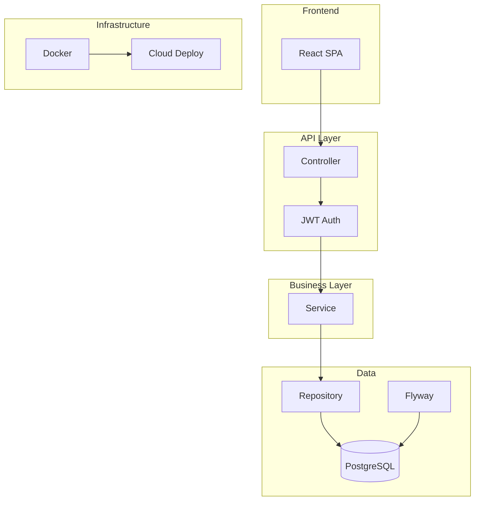

<!-- Profile photo: assets/profile.jpg (120x120, circular crop) -->

 

  Building production-grade backend systems with Spring Boot, React, and PostgreSQL.

 

  <a href="https://github.com/karthikJKST/karthik-portfolio"><code style="background: rgba(88,166,255,0.1); color: #58a6ff; padding: 6px 16px; border-radius: 6px;">Portfolio</code></a>
  <a href="jana_karthik_siva_teja_Resume.pdf"><code style="background: rgba(63,185,80,0.1); color: #3fb950; padding: 6px 16px; border-radius: 6px;">Resume</code></a>
  <a href="https://linkedin.com/in/karthik-siva-teja-jana-a367a0275"><code style="background: rgba(88,166,255,0.1); color: #58a6ff; padding: 6px 16px; border-radius: 6px;">LinkedIn</code></a>
  <a href="mailto:karthikshivatejaj@gmail.com"><code style="background: rgba(201,209,217,0.1); color: #c9d1d9; padding: 6px 16px; border-radius: 6px;">Email</code></a>
  <a href="https://github.com/karthikJKST"><code style="background: rgba(201,209,217,0.1); color: #c9d1d9; padding: 6px 16px; border-radius: 6px;">GitHub</code></a>

 

<!-- Stat cards -->
<table>
  <tr>
    <td align="center" width="16%" style="background: #161b22; border: 1px solid #30363d; border-radius: 8px; padding: 16px 8px;">6+ Projects</td>
    <td align="center" width="16%" style="background: #161b22; border: 1px solid #30363d; border-radius: 8px; padding: 16px 8px;">3 Live Apps</td>
    <td align="center" width="16%" style="background: #161b22; border: 1px solid #30363d; border-radius: 8px; padding: 16px 8px;">30+ REST APIs</td>
    <td align="center" width="16%" style="background: rgba(109,179,63,0.08); border: 1px solid rgba(109,179,63,0.2); border-radius: 8px; padding: 16px 4px;">Spring Boot</td>
    <td align="center" width="16%" style="background: rgba(70,130,255,0.08); border: 1px solid rgba(70,130,255,0.2); border-radius: 8px; padding: 16px 4px;">PostgreSQL</td>
    <td align="center" width="16%" style="background: rgba(0,150,255,0.08); border: 1px solid rgba(0,150,255,0.2); border-radius: 8px; padding: 16px 4px;">Docker</td>
  </tr>
</table>

 

---

 

## Featured Project

<table>
  <tr>
    <td width="58%" valign="top">
      
    </td>
    <td width="42%" valign="top" style="padding-left: 24px;">
      <h2 style="margin: 0 0 4px;">WeekDays</h2>
      
● Live in Production

      

        Production project management platform — Kanban boards, task tracking, real-time analytics, and team collaboration.
      

      

        <code style="background: rgba(240,246,252,0.08); color: #f0f6fc; padding: 3px 10px; border-radius: 6px; font-size: 0.8rem;">Spring Boot</code>
        <code style="background: rgba(240,246,252,0.08); color: #f0f6fc; padding: 3px 10px; border-radius: 6px; font-size: 0.8rem;">React 19</code>
        <code style="background: rgba(240,246,252,0.08); color: #f0f6fc; padding: 3px 10px; border-radius: 6px; font-size: 0.8rem;">PostgreSQL</code>
        <code style="background: rgba(240,246,252,0.08); color: #f0f6fc; padding: 3px 10px; border-radius: 6px; font-size: 0.8rem;">Docker</code>
        <code style="background: rgba(240,246,252,0.08); color: #f0f6fc; padding: 3px 10px; border-radius: 6px; font-size: 0.8rem;">JWT</code>
      

      <table>
        <tr>
          <td valign="top" width="50%" style="font-size: 0.8rem; color: #8b949e;">Architecture Controllers → Services → JPA Repositories</td>
          <td valign="top" width="50%" style="font-size: 0.8rem; color: #8b949e;">Auth JWT access + refresh tokens</td>
        </tr>
        <tr>
          <td valign="top" width="50%" style="font-size: 0.8rem; color: #8b949e;">Database PostgreSQL · Flyway migrations</td>
          <td valign="top" width="50%" style="font-size: 0.8rem; color: #8b949e;">Deploy Vercel + Render + Docker</td>
        </tr>
      </table>
       
      <a href="https://weekdays-gules.vercel.app" style="display: inline-block; background: #238636; color: white; padding: 10px 24px; border-radius: 6px; text-decoration: none; font-size: 0.9rem; font-weight: 500;">Live Demo</a>
      &nbsp;&nbsp;
      <a href="https://github.com/karthikJKST/WeekDays" style="display: inline-block; border: 1px solid #30363d; color: #f0f6fc; padding: 10px 24px; border-radius: 6px; text-decoration: none; font-size: 0.9rem;">Repository</a>
    </td>
  </tr>
</table>

 

---

 

## Projects

<table>
  <tr>
    <td width="50%" valign="top" style="background: #161b22; border: 1px solid #30363d; border-radius: 8px; padding: 20px;">
      
      <h3 style="margin: 12px 0 4px;">StockFlow</h3>
      
● Live

      
Real-time stock analysis with live quotes, technical indicators, and portfolio tracking.

      

        <code style="background: rgba(240,246,252,0.08); color: #f0f6fc; padding: 2px 8px; border-radius: 6px; font-size: 0.75rem;">Spring Boot</code>
        <code style="background: rgba(240,246,252,0.08); color: #f0f6fc; padding: 2px 8px; border-radius: 6px; font-size: 0.75rem;">WebSocket</code>
        <code style="background: rgba(240,246,252,0.08); color: #f0f6fc; padding: 2px 8px; border-radius: 6px; font-size: 0.75rem;">React</code>
        <code style="background: rgba(240,246,252,0.08); color: #f0f6fc; padding: 2px 8px; border-radius: 6px; font-size: 0.75rem;">PostgreSQL</code>
      

      <a href="https://stock-flow-ashen.vercel.app" style="color: #58a6ff; font-size: 0.85rem;">Live Demo →</a>
      &nbsp;
      <a href="https://github.com/karthikJKST/StockFlow" style="color: #8b949e; font-size: 0.85rem;">Repo</a>
    </td>
    <td width="50%" valign="top" style="background: #161b22; border: 1px solid #30363d; border-radius: 8px; padding: 20px;">
      
      <h3 style="margin: 12px 0 4px;">HirePilot</h3>
      
● Live

      
AI interview preparation with Gemini question generation and resume matching.

      

        <code style="background: rgba(240,246,252,0.08); color: #f0f6fc; padding: 2px 8px; border-radius: 6px; font-size: 0.75rem;">FastAPI</code>
        <code style="background: rgba(240,246,252,0.08); color: #f0f6fc; padding: 2px 8px; border-radius: 6px; font-size: 0.75rem;">Gemini API</code>
        <code style="background: rgba(240,246,252,0.08); color: #f0f6fc; padding: 2px 8px; border-radius: 6px; font-size: 0.75rem;">React</code>
      

      <a href="https://ai-career-assistant-b9cs.onrender.com" style="color: #58a6ff; font-size: 0.85rem;">Live Demo →</a>
      &nbsp;
      <a href="https://github.com/karthikJKST/AI-Career-Assistant" style="color: #8b949e; font-size: 0.85rem;">Repo</a>
    </td>
  </tr>
  <tr>
    <td width="50%" valign="top" style="background: #161b22; border: 1px solid #30363d; border-radius: 8px; padding: 20px;">
      

        Terminal Preview
      

      <h3 style="margin: 0 0 4px;">Phoenix</h3>
      
● Beta

      
AI desktop assistant with LLM planning, voice control, and cross-app automation.

      

        <code style="background: rgba(240,246,252,0.08); color: #f0f6fc; padding: 2px 8px; border-radius: 6px; font-size: 0.75rem;">Python</code>
        <code style="background: rgba(240,246,252,0.08); color: #f0f6fc; padding: 2px 8px; border-radius: 6px; font-size: 0.75rem;">LLM</code>
        <code style="background: rgba(240,246,252,0.08); color: #f0f6fc; padding: 2px 8px; border-radius: 6px; font-size: 0.75rem;">Desktop</code>
      

      <a href="https://github.com/karthikJKST/PHOENIX" style="color: #8b949e; font-size: 0.85rem;">Repo →</a>
    </td>
    <td width="50%" valign="top">
    </td>
  </tr>
</table>

 

## Engineering

<table>
  <tr>
    <td valign="top" width="25%" style="background: #161b22; border: 1px solid #30363d; border-radius: 8px; padding: 16px;">
      
<strong>⚡ REST APIs</strong>

      
30+ endpoints · Layered architecture · Input validation

    </td>
    <td valign="top" width="25%" style="background: #161b22; border: 1px solid #30363d; border-radius: 8px; padding: 16px;">
      
<strong>🔐 JWT Security</strong>

      
Access + refresh tokens · Spring Security · BCrypt

    </td>
    <td valign="top" width="25%" style="background: #161b22; border: 1px solid #30363d; border-radius: 8px; padding: 16px;">
      
<strong>🐳 Docker</strong>

      
Multi-stage builds · Compose orchestration · Health checks

    </td>
    <td valign="top" width="25%" style="background: #161b22; border: 1px solid #30363d; border-radius: 8px; padding: 16px;">
      
<strong>🔄 CI/CD</strong>

      
GitHub Actions · Build + test · Automated deploy

    </td>
  </tr>
  <tr>
    <td valign="top" width="25%" style="background: #161b22; border: 1px solid #30363d; border-radius: 8px; padding: 16px;">
      
<strong>🗄 PostgreSQL</strong>

      
Flyway migrations · JPA/Hibernate · Connection pooling

    </td>
    <td valign="top" width="25%" style="background: #161b22; border: 1px solid #30363d; border-radius: 8px; padding: 16px;">
      
<strong>🌐 WebSocket</strong>

      
STOMP streaming · Real-time data · Live updates

    </td>
    <td valign="top" width="25%" style="background: #161b22; border: 1px solid #30363d; border-radius: 8px; padding: 16px;">
      
<strong>☁ Cloud</strong>

      
Vercel · Render · Neon PostgreSQL

    </td>
    <td valign="top" width="25%" style="background: #161b22; border: 1px solid #30363d; border-radius: 8px; padding: 16px;">
      
<strong>🌱 Spring Boot</strong>

      
Security · JPA · Actuator · Validation

    </td>
  </tr>
</table>

 

---

 

## Architecture

 

---

 

## Journey

<table>
  <tr>
    <td align="center" width="22%" style="padding: 12px;">
      
2024

      
Foundation

      
Java · SQL · DSA

    </td>
    <td align="center" width="4%" style="color: #30363d; font-size: 1.2rem;">→</td>
    <td align="center" width="22%" style="padding: 12px;">
      
2025

      
Full Stack

      
Spring Boot · React · PostgreSQL

    </td>
    <td align="center" width="4%" style="color: #30363d; font-size: 1.2rem;">→</td>
    <td align="center" width="22%" style="padding: 12px;">
      
2026

      
DevOps

      
Docker · JWT · CI/CD · Cloud

    </td>
    <td align="center" width="4%" style="color: #30363d; font-size: 1.2rem;">→</td>
    <td align="center" width="22%" style="background: rgba(88,166,255,0.08); border: 1px solid rgba(88,166,255,0.2); border-radius: 8px; padding: 16px;">
      
Now

      
Scale

      
Building scalable backend systems

    </td>
  </tr>
</table>

 

---

 

## Focus

<table>
  <tr>
    <td width="25%" valign="top" style="background: #161b22; border: 1px solid #30363d; border-radius: 8px; padding: 16px;">
      
<strong style="color: #f0f6fc;">🔨 Building</strong>

      
Event-driven Spring Boot with CQRS, message queues, and Redis caching.

    </td>
    <td width="25%" valign="top" style="background: #161b22; border: 1px solid #30363d; border-radius: 8px; padding: 16px;">
      
<strong style="color: #f0f6fc;">📖 Learning</strong>

      
Kubernetes, distributed systems, observability, testing.

    </td>
    <td width="25%" valign="top" style="background: #161b22; border: 1px solid #30363d; border-radius: 8px; padding: 16px;">
      
<strong style="color: #f0f6fc;">🔭 Exploring</strong>

      
Domain-driven design, hexagonal architecture, event sourcing.

    </td>
    <td width="25%" valign="top" style="background: #161b22; border: 1px solid #30363d; border-radius: 8px; padding: 16px;">
      
<strong style="color: #f0f6fc;">📚 Reading</strong>

      
Designing Data-Intensive Applications · Clean Architecture

    </td>
  </tr>
</table>

 

---

 

### GitHub

 

 
 

### Let's Build Together

  Open to software engineering opportunities — Java backend, full-stack, and distributed systems.

 

  <a href="https://github.com/karthikJKST/karthik-portfolio"><code style="background: rgba(88,166,255,0.1); color: #58a6ff; padding: 6px 16px; border-radius: 6px;">Portfolio</code></a>
  <a href="jana_karthik_siva_teja_Resume.pdf"><code style="background: rgba(63,185,80,0.1); color: #3fb950; padding: 6px 16px; border-radius: 6px;">Resume</code></a>
  <a href="https://linkedin.com/in/karthik-siva-teja-jana-a367a0275"><code style="background: rgba(88,166,255,0.1); color: #58a6ff; padding: 6px 16px; border-radius: 6px;">LinkedIn</code></a>
  <a href="mailto:karthikshivatejaj@gmail.com"><code style="background: rgba(201,209,217,0.1); color: #c9d1d9; padding: 6px 16px; border-radius: 6px;">Email</code></a>

 

