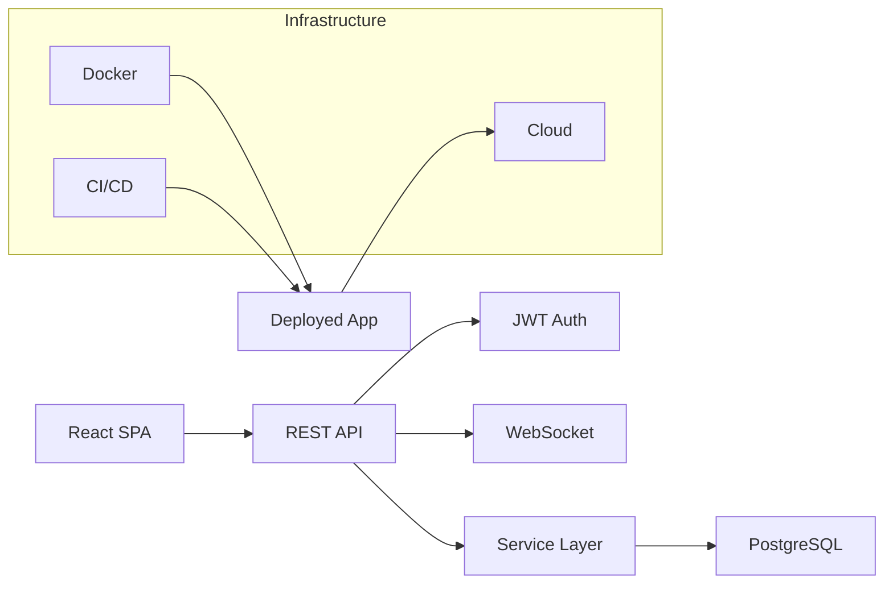

<div align="center">
  <br/>
  <h1>Jana Karthik Siva Teja</h1>
  <p style="font-size: 1.15rem; color: #8b949e; max-width: 600px; margin: 0 auto;">
    Software Engineer · Spring Boot · React · PostgreSQL
  </p>
  <br/>
  <p style="font-size: 0.95rem;">
    <a href="https://linkedin.com/in/karthik-siva-teja-jana-a367a0275" style="color: #58a6ff;">LinkedIn</a>
    ·
    <a href="mailto:karthikshivatejaj@gmail.com" style="color: #58a6ff;">Email</a>
    ·
    <a href="jana_karthik_siva_teja_Resume.pdf" style="color: #58a6ff;">Resume</a>
    ·
    <a href="https://github.com/karthikJKST" style="color: #58a6ff;">GitHub</a>
  </p>
  <br/>
</div>

---

I build production-grade backend systems with **Java, Spring Boot, PostgreSQL, and Docker**. Currently pursuing Computer Science at VIT-AP (2022–2026), I focus on clean architecture, REST API design, authentication systems, and cloud deployment — producing software that is testable, maintainable, and production-ready from day one.

---

## Engineering

```text
Languages       Java, Python, JavaScript, TypeScript, SQL
Backend         Spring Boot 3, Spring Security, JPA/Hibernate, JWT, FastAPI, Node.js
Frontend        React 19, TypeScript, Tailwind CSS, Vite, React Query
Database        PostgreSQL, MongoDB, SQLite, H2, Flyway
Infrastructure  Docker, Docker Compose, GitHub Actions, Nginx, Vercel, Render
AI/ML           TensorFlow, Scikit-learn, CNN, Transfer Learning, Gemini API
Tools           Git, Maven, IntelliJ, Postman, Linux
```

---

## Architecture Philosophy



I build with **separation of concerns** — controllers handle HTTP, services contain business logic, repositories manage data access. APIs are RESTful, authenticated via JWT, and designed for consumers. Every service is containerized, database migrations are version-controlled, and deployments run through CI/CD pipelines.

---

## Projects

### WeekDays

<table>
  <tr>
    <td width="65%" valign="top">
      <p><em>Production-grade project management platform</em></p>
      <p>Kanban boards, task tracking, calendar views, analytics dashboards, and real-time notifications. Built with a layered Spring Boot backend and React frontend, deployed with Docker Compose.</p>

      <p><strong>Stack:</strong> Spring Boot 3 · Java 21 · React 19 · TypeScript · PostgreSQL · Docker · JWT · Flyway</p>

      <p><strong>Engineering:</strong></p>
      <ul>
        <li>JWT authentication with access/refresh token rotation</li>
        <li>Layered architecture: Controllers → Services → JPA Repositories</li>
        <li>Database migrations via Flyway with PostgreSQL</li>
        <li>Multi-stage Docker builds with health checks</li>
        <li>Docker Compose orchestration (PostgreSQL + API + Nginx)</li>
      </ul>

      <a href="https://github.com/karthikJKST/WeekDays">Source</a> ·
      <a href="https://weekdays-gules.vercel.app">Live Demo</a> ·
      <a href="https://weekdays-nznb.onrender.com/actuator/health">API Health</a>
    </td>
    <td width="35%" valign="top">
      <table>
        <tr><td><strong>Auth</strong></td><td>JWT + Refresh</td></tr>
        <tr><td><strong>Database</strong></td><td>PostgreSQL 16</td></tr>
        <tr><td><strong>Migrations</strong></td><td>Flyway</td></tr>
        <tr><td><strong>Container</strong></td><td>Docker Compose</td></tr>
        <tr><td><strong>Frontend</strong></td><td>Vercel</td></tr>
        <tr><td><strong>Backend</strong></td><td>Render</td></tr>
      </table>
    </td>
  </tr>
</table>

---

### StockFlow

<table>
  <tr>
    <td width="65%" valign="top">
      <p><em>Real-time stock market intelligence platform</em></p>
      <p>Live quotes, technical analysis indicators (SMA, EMA, RSI, MACD, Bollinger Bands), portfolio tracking with P&L, stock screener, and paper trading.</p>

      <p><strong>Stack:</strong> Spring Boot 3 · Java 21 · React · TypeScript · PostgreSQL · WebSocket · Finnhub API</p>

      <p><strong>Engineering:</strong></p>
      <ul>
        <li>Real-time price streaming via STOMP WebSocket</li>
        <li>Technical indicators with configurable parameters</li>
        <li>Portfolio tracking with P&L and allocation charts</li>
        <li>CI/CD pipeline: build, test, typecheck, Docker</li>
        <li>Graceful fallback from live API to simulated data</li>
      </ul>

      <a href="https://github.com/karthikJKST/StockFlow">Source</a> ·
      <a href="https://stock-flow-ashen.vercel.app">Live Demo</a>
    </td>
    <td width="35%" valign="top">
      <table>
        <tr><td><strong>Real-time</strong></td><td>STOMP/WebSocket</td></tr>
        <tr><td><strong>Market Data</strong></td><td>Finnhub API</td></tr>
        <tr><td><strong>CI/CD</strong></td><td>GitHub Actions</td></tr>
        <tr><td><strong>Database</strong></td><td>PostgreSQL</td></tr>
        <tr><td><strong>Frontend</strong></td><td>Vercel</td></tr>
        <tr><td><strong>Backend</strong></td><td>Render</td></tr>
      </table>
    </td>
  </tr>
</table>

---

### AI-Career-Assistant (HirePilot)

<table>
  <tr>
    <td width="65%" valign="top">
      <p><em>AI-powered interview preparation and resume analysis</em></p>
      <p>Generates personalized interview questions from resumes, evaluates answers across 7 dimensions, and matches resumes against job descriptions using Gemini AI.</p>

      <p><strong>Stack:</strong> FastAPI · Python · React · Gemini API · SQLite · JWT</p>

      <p><strong>Engineering:</strong></p>
      <ul>
        <li>AI question generation from resume parsing (PyMuPDF)</li>
        <li>Real-time answer evaluation with 7 scoring metrics</li>
        <li>ATS resume matching via Gemini API</li>
        <li>JWT authentication with rate limiting (SlowAPI)</li>
        <li>Voice support: speech-to-text and text-to-speech</li>
      </ul>

      <a href="https://github.com/karthikJKST/AI-Career-Assistant">Source</a> ·
      <a href="https://ai-career-assistant-b9cs.onrender.com">Live API</a>
    </td>
    <td width="35%" valign="top">
      <table>
        <tr><td><strong>AI Model</strong></td><td>Gemini API</td></tr>
        <tr><td><strong>Rate Limiting</strong></td><td>SlowAPI</td></tr>
        <tr><td><strong>Auth</strong></td><td>JWT</td></tr>
        <tr><td><strong>Voice</strong></td><td>Web Speech API</td></tr>
        <tr><td><strong>Reports</strong></td><td>PDF (ReportLab)</td></tr>
      </table>
    </td>
  </tr>
</table>

---

### Additional Projects

<table>
  <tr>
    <td width="50%" valign="top">

#### PHOENIX
*AI desktop automation assistant*

Modular system with 20+ action modules, LLM-based planning, voice interface, and cross-application desktop control.

**Python · LLM · Desktop Automation**

<a href="https://github.com/karthikJKST/PHOENIX">Source</a>

    </td>
    <td width="50%" valign="top">

#### Diabetic Retinopathy Detection
*Deep learning for medical imaging*

CNN and ResNet50 architectures for retinal image classification. Flask web interface, OpenCV preprocessing, trained on benchmark datasets.

**TensorFlow · CNN · ResNet50 · Flask**

<a href="https://github.com/karthikJKST/Diabetic_retinopathy">Source</a>

    </td>
  </tr>
  <tr>
    <td width="50%" valign="top">

#### Portfolio Website
*Personal developer portfolio*

Glassmorphism design with Framer Motion animations, responsive layout, component-based React architecture.

**React · JavaScript · CSS · Vite**

<a href="https://github.com/karthikJKST/karthik-portfolio">Source</a>

    </td>
    <td width="50%" valign="top">
    </td>
  </tr>
</table>

---

## Production Experience

<table>
  <tr>
    <td align="center" width="16%"><strong>6</strong><br/><span style="color: #8b949e;">Projects</span></td>
    <td align="center" width="16%"><strong>3</strong><br/><span style="color: #8b949e;">Live Deployments</span></td>
    <td align="center" width="16%"><strong>✓</strong><br/><span style="color: #8b949e;">Dockerized</span></td>
    <td align="center" width="16%"><strong>✓</strong><br/><span style="color: #8b949e;">CI/CD</span></td>
    <td align="center" width="16%"><strong>✓</strong><br/><span style="color: #8b949e;">JWT Auth</span></td>
    <td align="center" width="16%"><strong>✓</strong><br/><span style="color: #8b949e;">PostgreSQL</span></td>
  </tr>
</table>

<br/>

| Capability | Implementations |
|---|---|
| **Authentication** | JWT access/refresh tokens, BCrypt hashing, Spring Security filters |
| **REST APIs** | Layered architecture, input validation, CORS, error handling |
| **Database** | PostgreSQL, Flyway migrations, JPA/Hibernate, connection pooling |
| **Containerization** | Multi-stage Docker builds, Compose orchestration, health checks, non-root users |
| **CI/CD** | GitHub Actions: automated build, test, typecheck, Docker image build |
| **Real-time** | WebSocket streaming via STOMP over SockJS |
| **Security** | Rate limiting, input validation, secure headers, dependency management |
| **Deployment** | Vercel (frontend), Render (backend), Neon (database) |
| **Monitoring** | Spring Actuator health checks, structured logging |

---

## Currently Building

Event-driven Spring Boot application with **CQRS pattern**, message queues for async processing, and **Redis caching**. Exploring **domain-driven design** and **hexagonal architecture**.

---

## Currently Learning

- **Kubernetes** — Container orchestration, Helm charts, cluster management
- **Distributed Systems** — Consistency models, partitioning, replication
- **Testing** — Integration tests, end-to-end tests, test containers
- **Observability** — Structured logging, metrics, distributed tracing

---

## Certifications

- **MongoDB Associate Database Administrator** — MongoDB (July 2025)
- **AI using Google TensorFlow** — SmartInternz (2025)

---

<div align="center">
  <p style="color: #8b949e;">
    Open to software engineering opportunities — Java backend, full-stack, and distributed systems.
  </p>
  <p style="font-size: 0.9rem;">
    <a href="https://linkedin.com/in/karthik-siva-teja-jana-a367a0275" style="color: #58a6ff;">LinkedIn</a>
    ·
    <a href="mailto:karthikshivatejaj@gmail.com" style="color: #58a6ff;">Email</a>
    ·
    <a href="jana_karthik_siva_teja_Resume.pdf" style="color: #58a6ff;">Resume</a>
  </p>
  <br/>
</div>
