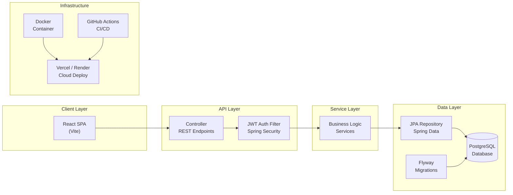

<div align="center">
  <br/>
  <h1>Jana Karthik Siva Teja</h1>
  <p style="font-size: 1.15rem; color: #8b949e; max-width: 600px; margin: 0 auto;">
    Software Engineer · Spring Boot · React · PostgreSQL
  </p>
  <br/>
  <p style="font-size: 0.95rem;">
    <a href="https://linkedin.com/in/karthik-siva-teja-jana-a367a0275" style="color: #58a6ff;">LinkedIn</a>
    ·
    <a href="mailto:karthikshivatejaj@gmail.com" style="color: #58a6ff;">Email</a>
    ·
    <a href="jana_karthik_siva_teja_Resume.pdf" style="color: #58a6ff;">Resume</a>
    ·
    <a href="https://github.com/karthikJKST/karthik-portfolio" style="color: #58a6ff;">Portfolio</a>
    ·
    <a href="https://github.com/karthikJKST" style="color: #58a6ff;">GitHub</a>
  </p>
  <br/>
</div>

I build production-grade backend systems with **Java, Spring Boot, PostgreSQL, and Docker**. Currently pursuing Computer Science at VIT-AP (2022–2026), I focus on clean architecture, REST API design, authentication systems, and cloud deployment — producing software that is testable, maintainable, and production-ready from day one.

---

## Engineering

```text
Languages       Java, Python, JavaScript, TypeScript, SQL
Backend         Spring Boot 3, Spring Security, JPA/Hibernate, JWT, FastAPI, Node.js
Frontend        React 19, TypeScript, Tailwind CSS, Vite, React Query
Database        PostgreSQL, MongoDB, SQLite, H2, Flyway
Infrastructure  Docker, Docker Compose, GitHub Actions, Nginx, Vercel, Render
AI/ML           TensorFlow, Scikit-learn, CNN, Transfer Learning, Gemini API
Tools           Git, Maven, IntelliJ, Postman, Linux
```

---

## Architecture



**Layered architecture:** Controllers handle HTTP, services contain business logic, repositories manage data access. Every component is containerized, database changes are version-controlled, and deployments are automated.

---

## Projects

### WeekDays

<table>
  <tr>
    <td width="65%" valign="top">
      <p><em>Production-grade project management platform</em></p>
      <p>Kanban boards, task tracking, calendar views, analytics dashboards, and real-time notifications deployed with Docker Compose across Vercel and Render.</p>

      <p><strong>Stack:</strong> Spring Boot 3 · Java 21 · React 19 · TypeScript · PostgreSQL · Docker · JWT · Flyway</p>

      <p><strong>Highlights:</strong></p>
      <ul>
        <li>JWT authentication with access/refresh token rotation</li>
        <li>Layered architecture: Controller → Service → JPA Repository</li>
        <li>Database migrations via Flyway with PostgreSQL 16</li>
        <li>Multi-stage Docker builds with health checks and non-root user</li>
        <li>Docker Compose orchestration with Nginx reverse proxy</li>
      </ul>

      <a href="https://github.com/karthikJKST/WeekDays">Source</a> ·
      <a href="https://weekdays-gules.vercel.app">Live Demo</a> ·
      <a href="https://weekdays-nznb.onrender.com/actuator/health">API Health</a>

      <details>
        <summary>Project structure</summary>

        ```text
        backend/
          src/main/java/com/weekdays/api/
            auth/          JWT authentication
            config/        Security configuration
            project/       Project management
            task/          Task management
            calendar/      Calendar events
            analytics/     Dashboard metrics
            notification/  Push notifications
            timeline/      Activity feed
            user/          User entity
          src/main/resources/
            db/migration/  Flyway migrations
        frontend/
          src/
            api/           API client
            components/    UI components
            pages/         Route pages
            store/         Zustand state
        ```
      </details>
    </td>
    <td width="35%" valign="top">
      <table>
        <tr><td><strong>Auth</strong></td><td>JWT + Refresh</td></tr>
        <tr><td><strong>Database</strong></td><td>PostgreSQL 16</td></tr>
        <tr><td><strong>Migrations</strong></td><td>Flyway</td></tr>
        <tr><td><strong>Container</strong></td><td>Docker Compose</td></tr>
        <tr><td><strong>Frontend</strong></td><td>Vercel</td></tr>
        <tr><td><strong>Backend</strong></td><td>Render</td></tr>
        <tr><td><strong>Security</strong></td><td>JWT, BCrypt, CORS</td></tr>
      </table>
    </td>
  </tr>
</table>

---

### StockFlow

<table>
  <tr>
    <td width="65%" valign="top">
      <p><em>Real-time stock market intelligence platform</em></p>
      <p>Live quotes, technical analysis indicators (SMA, EMA, RSI, MACD, Bollinger Bands), portfolio tracking with P&L, stock screener, and paper trading.</p>

      <p><strong>Stack:</strong> Spring Boot 3 · Java 21 · React · TypeScript · PostgreSQL · WebSocket · Finnhub API</p>

      <p><strong>Highlights:</strong></p>
      <ul>
        <li>Real-time price streaming via STOMP WebSocket</li>
        <li>Technical indicators with configurable parameters</li>
        <li>Portfolio tracking with P&L and allocation charts</li>
        <li>CI/CD pipeline: build, test, typecheck, Docker build</li>
        <li>Graceful fallback from live API to simulated data</li>
      </ul>

      <a href="https://github.com/karthikJKST/StockFlow">Source</a> ·
      <a href="https://stock-flow-ashen.vercel.app">Live Demo</a>

      <details>
        <summary>Security & reliability</summary>

        - API key managed via environment variables (Finnhub key)
        - Rate limiting protection against API quota exhaustion
        - Graceful degradation: automated fallback to simulated data
        - Input validation on all stock search and filter endpoints
        - SQL injection protection via JPA parameterized queries
      </details>
    </td>
    <td width="35%" valign="top">
      <table>
        <tr><td><strong>Real-time</strong></td><td>STOMP WebSocket</td></tr>
        <tr><td><strong>Market Data</strong></td><td>Finnhub API</td></tr>
        <tr><td><strong>CI/CD</strong></td><td>GitHub Actions</td></tr>
        <tr><td><strong>Database</strong></td><td>PostgreSQL</td></tr>
        <tr><td><strong>Frontend</strong></td><td>Vercel</td></tr>
        <tr><td><strong>Backend</strong></td><td>Render</td></tr>
      </table>
    </td>
  </tr>
</table>

---

### AI-Career-Assistant (HirePilot)

<table>
  <tr>
    <td width="65%" valign="top">
      <p><em>AI-powered interview preparation and resume analysis</em></p>
      <p>Generates personalized interview questions from resumes, evaluates answers across 7 dimensions, and matches resumes against job descriptions using Google Gemini AI.</p>

      <p><strong>Stack:</strong> FastAPI · Python · React · Gemini API · SQLite · JWT</p>

      <p><strong>Highlights:</strong></p>
      <ul>
        <li>AI question generation from resume parsing (PyMuPDF)</li>
        <li>Real-time answer evaluation with 7 scoring metrics</li>
        <li>ATS resume matching via Gemini API</li>
        <li>JWT authentication with rate limiting (SlowAPI)</li>
        <li>Voice support: speech-to-text and text-to-speech</li>
      </ul>

      <a href="https://github.com/karthikJKST/AI-Career-Assistant">Source</a> ·
      <a href="https://ai-career-assistant-b9cs.onrender.com">Live API</a>
    </td>
    <td width="35%" valign="top">
      <table>
        <tr><td><strong>AI Model</strong></td><td>Gemini API</td></tr>
        <tr><td><strong>Rate Limiting</strong></td><td>SlowAPI</td></tr>
        <tr><td><strong>Auth</strong></td><td>JWT</td></tr>
        <tr><td><strong>Voice</strong></td><td>Web Speech API</td></tr>
        <tr><td><strong>Reports</strong></td><td>PDF (ReportLab)</td></tr>
        <tr><td><strong>Env Validation</strong></td><td>Startup checks</td></tr>
      </table>
    </td>
  </tr>
</table>

---

### Additional Projects

<table>
  <tr>
    <td width="50%" valign="top">

#### PHOENIX
*AI desktop automation assistant*

Modular system with 20+ action modules, LLM-based planning engine, voice interface, and cross-application desktop control via PyAutoGUI.

**Python · LLM · Desktop Automation · Speech**

<a href="https://github.com/karthikJKST/PHOENIX">Source</a>

    </td>
    <td width="50%" valign="top">

#### Diabetic Retinopathy Detection
*Deep learning for medical imaging*

CNN and ResNet50 architectures for retinal image classification. Flask web interface, OpenCV preprocessing pipeline, trained on benchmark datasets.

**TensorFlow · CNN · ResNet50 · Flask · OpenCV**

<a href="https://github.com/karthikJKST/Diabetic_retinopathy">Source</a>

    </td>
  </tr>
  <tr>
    <td width="50%" valign="top">

#### Portfolio Website
*Personal developer portfolio*

Glassmorphism design with Framer Motion animations, component-based React architecture, responsive layout, and Vite build system.

**React · JavaScript · CSS · Vite · Framer Motion**

<a href="https://github.com/karthikJKST/karthik-portfolio">Source</a>

    </td>
    <td width="50%" valign="top">
    </td>
  </tr>
</table>

---

## Production Experience

<table>
  <tr>
    <td align="center" width="16%"><strong>6</strong><br/><span style="color: #8b949e; font-size: 0.85rem;">Projects</span></td>
    <td align="center" width="16%"><strong>3</strong><br/><span style="color: #8b949e; font-size: 0.85rem;">Live Deployments</span></td>
    <td align="center" width="16%"><strong>✓</strong><br/><span style="color: #8b949e; font-size: 0.85rem;">Dockerized</span></td>
    <td align="center" width="16%"><strong>✓</strong><br/><span style="color: #8b949e; font-size: 0.85rem;">CI/CD</span></td>
    <td align="center" width="16%"><strong>✓</strong><br/><span style="color: #8b949e; font-size: 0.85rem;">JWT Auth</span></td>
    <td align="center" width="16%"><strong>✓</strong><br/><span style="color: #8b949e; font-size: 0.85rem;">PostgreSQL</span></td>
  </tr>
</table>

<br/>

<blockquote>
  <strong>Authentication:</strong> JWT access/refresh tokens, BCrypt hashing, Spring Security filters, rate limiting
  <br/><br/>
  <strong>APIs:</strong> RESTful design, layered architecture, input validation, CORS, global error handling
  <br/><br/>
  <strong>Data:</strong> PostgreSQL with Flyway migrations, JPA/Hibernate, connection pooling via HikariCP
  <br/><br/>
  <strong>Infrastructure:</strong> Multi-stage Docker builds, Compose orchestration, health checks, CI/CD pipelines
  <br/><br/>
  <strong>Real-time:</strong> WebSocket streaming via STOMP over SockJS for live data delivery
</blockquote>

---

## Currently

<blockquote>
  <strong>Building:</strong> Event-driven Spring Boot with CQRS pattern, message queues, and Redis caching
  <br/><br/>
  <strong>Learning:</strong> Kubernetes orchestration, distributed systems design, integration testing, observability
</blockquote>

---

## Certifications

- **MongoDB Associate Database Administrator** — MongoDB (July 2025)
- **AI using Google TensorFlow** — SmartInternz (2025)

---

<div align="center">
  <p style="color: #8b949e;">
    Open to software engineering opportunities — Java backend, full-stack, and distributed systems.
  </p>
  <p style="font-size: 0.9rem;">
    <a href="https://linkedin.com/in/karthik-siva-teja-jana-a367a0275" style="color: #58a6ff;">LinkedIn</a>
    ·
    <a href="mailto:karthikshivatejaj@gmail.com" style="color: #58a6ff;">Email</a>
    ·
    <a href="jana_karthik_siva_teja_Resume.pdf" style="color: #58a6ff;">Resume</a>
    ·
    <a href="https://github.com/karthikJKST/karthik-portfolio" style="color: #58a6ff;">Portfolio</a>
  </p>
  <br/>
</div>
